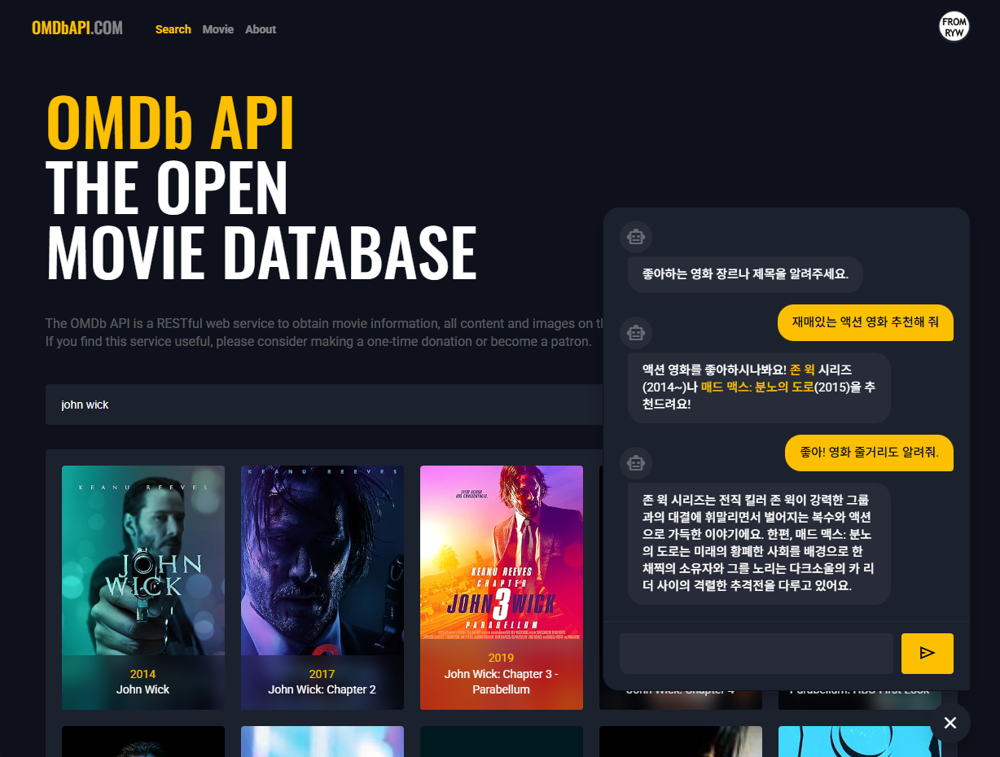
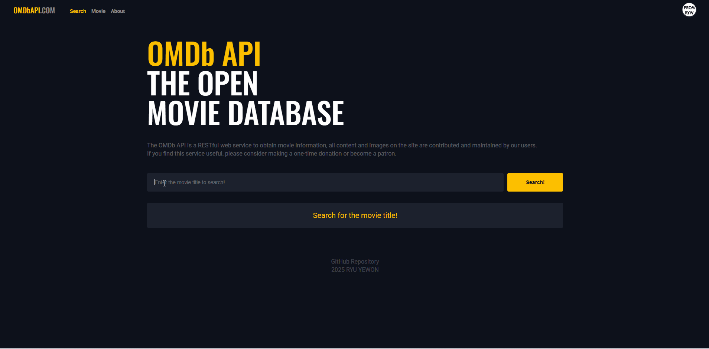
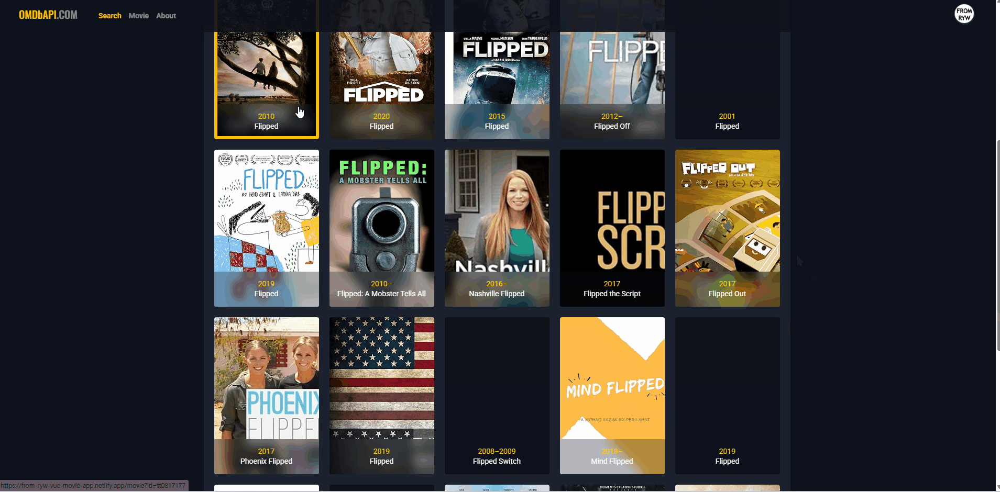
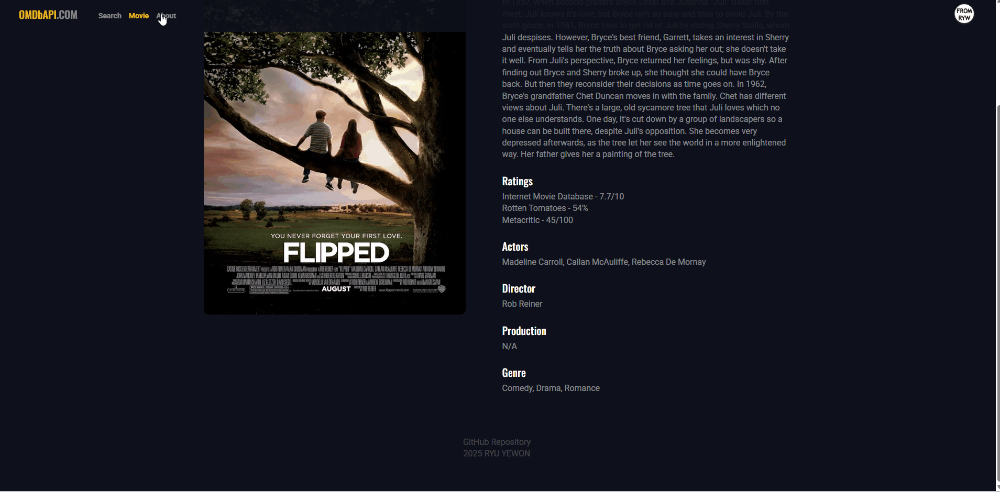
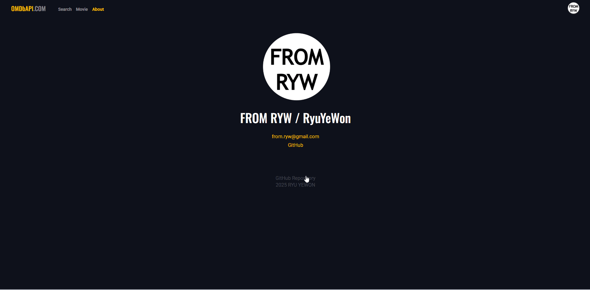
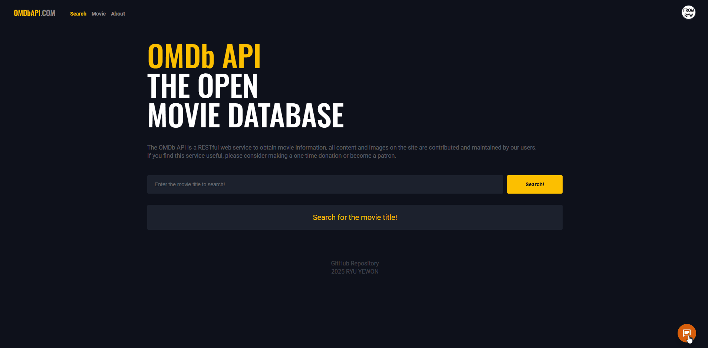

# OMDb API와 OpenAI API를를 활용한 영화 검색 프로젝트 (Vue.js 3 + AI Chat Bot)

[배포된 사이트 바로가기](https://from-ryw-vue-movie-app.netlify.app/)



이 프로젝트는 [패스트캠퍼스 - JavaScript 마스터 : API로 영화 검색 사이트](https://github.com/ParkYoungWoong/vanillajs-movie-app) 강의를 기반으로 제작되었습니다.
강의에서 진행한 VanillaJS 기반의 코드를 바탕으로 **Vue로 리팩토링**하고, **Netlify로 배포**하여
**학습 목적의 프로젝트**로 완성하였습니다.
2025년 4월 17일 **OpenAi의 API를 활용하여 챗봇 기능**을 추가하였습니다.

> ⚠️ 본 프로젝트는 교육 및 포트폴리오 용도로만 사용되며, 상업적 용도는 아닙니다.

<br>

## ✨ 주요 구현 기능

### 🔍 Search 페이지



- 영화 검색 기능
- 더보기 기능
- 영화 상세페이지 이동 기능
  <br>
  <br>

### 🎞️ Movie 페이지



- 영화 상세 정보 페이지
  <br>
  <br>

### 🙋‍♀️ About 페이지



- 개발자 소개 페이지
- 구글 이메일 보내기 기능
- GitHub 이동 기능
  <br>
  <br>

### 📎 Footer



- 해당 프로젝트 Repository 이동 기능
  <br>
  <br>

### 🤖 Chatbot



- OpenAI의 API를 사용해 영화 정보를 제공하는 챗봇 기능
- 대화 중 영화 제목 클릭 시, 검색 기능
  <br>
  <br>

<br>

## 🔧 사용 기술 스택

| 영역       | 사용 기술                                                                                |
| ---------- | ---------------------------------------------------------------------------------------- |
| 프레임워크 | Vue 3 (Composition API), Vite                                                            |
| 상태 관리  | Pinia, pinia-plugin-persistedstate                                                       |
| HTTP 통신  | Axios                                                                                    |
| 서버리스   | Netlify Functions (node-fetch 사용)                                                      |
| 배포       | Netlify                                                                                  |
| API        | [OMDb API](https://www.omdbapi.com/), [OpenAI API](https://openai.com/index/openai-api/) |

<br>

## 📝 참고사항

### OMDb API

- [OMDb API](https://www.omdbapi.com/)

### OpenAI API

- [OpenAI API](https://github.com/openai/openai-node)
- Fine-tuning: 결과 개선을 위해 모델을 특정 데이터셋에 맞게 조정하는 작업입니다.
  영화 제목으로 빠른 검색이 가능하도록, 다음과 같이 답변 방식을 조정합니다.

```Javascript
const fineTunedMessages: OpenAI.ChatCompletionMessageParam[] = [
  { role: 'system', content: '너는 영화 정보를 알려주는 챗봇이야! 어떤 방식으로든 답변에서의 영화 제목은 항상 {{한글제목//소문자영어제목}}(출시년도) 처럼 {{}} 기호로 제목을 묶어 // 기호로 한글과 영어 제목을 구분하고 () 기호로 영화의 출시년도를 표시해 줘! 그리고 영화의 한글 제목이 정확하지 않다면, 억지로 지어내지 말고 {{abc xyz}}(1234) 처럼 영어 제목만 표시해 줘.' },
  { role: 'assistant', content: '영화 {{기생충//parasite}}(2019)은 국제적으로 큰 주목을 받은 봉준호 감독 작품이에요. 현실적이면서도 예술적인 연출과 뛰어난 연기력으로 많은 관객들의 호응을 얻은 작품이죠.' },
  { role: 'assistant', content: '{{씽//sing}}(2016)은 코믹하면서도 감동적인 이야기로 관객들을 웃음 속으로 이끄는 애니메이션 영화입니다.' },
  { role: 'assistant', content: '{{존 윅//john wick}}(2014) 시리즈를 추천해요! 액션 신에서 배우 키아누 리브스가 매혹적인 액션 연기를 펼치는 영화로, 스타일리시한 액션과 복수의 이야기가 잘 어우러져 있어요.' },
  { role: 'assistant', content: '물론이죠! 퓨리오사 역으로 출연한 샤를리즈 테론의 영화로는 {{몬스터//monster}}(2003)와 {{매드 맥스: 분노의 도로//mad max: fury road}}(2015) 등이 있어요.' },
  { role: 'assistant', content: '가벼운 분위기의 영화를 추천해드릴게요. {{비커밍 제인//becoming jane}}(2007)는 제인 오스트렌의 청춘 시절을 다룬 멜로 영화로, 사랑과 운명을 그려낸 로맨틱한 작품이에요.' },
  { role: 'assistant', content: '한국에서 제작된 공포 및 스릴러 장르의 작품으로, 봉준호 감독이 연출한 {{괴물//the host}}(2006) 영화를 추천합니다. 한강을 배경으로 한 괴물의 출현과 이로 인한 사건을 중심으로 가족의 사랑과 희생을 그려내고 있습니다.' },
  { role: 'assistant', content: '크리스토퍼 놀란 감독이 연출한 {{인터스텔라//interstellar}}(2014) 과학과 인간 정서를 균형 있게 결합한 공상 과학 장르의 대표작입니다.' },
  { role: 'assistant', content: '{{아마데우스//amadeus}}(1984)를 추천해요. 밀로스 포먼 감독이 연출한 이 영화는 능력 있는 두 음악가, 볼프강 아마데우스 모차르트와 안토니오 살리에리의 관계를 중심으로 펼쳐지는 드라마입니다.' },
  { role: 'assistant', content: '{{반도//peninsula}}(2020)를 추천해드릴게요. 이 영화는 좀비로 인한 대재앙 이후를 그린 액션 스릴러 작품으로, 긴장감 넘치는 전투와 스릴을 즐길 수 있어요.' },
  { role: 'assistant', content: '매트릭스 시리즈는 현재까지 총 3편으로 이루어져 있어요. {{매트릭스//the matrix}}(1999)는 사이버 퓨처와 현실 사이의 모순에 관한 기발한 아이디어의 인상적인 작품이에요. {{매트릭스 리로디드//the matrix reloaded}}(2003)는 첫 번째 영화의 이야기를 이어받아 전개되는 작품이에요. {{매트릭스 레볼루션//the matrix revolutions}}(2003)은 매트릭스 시리즈의 마지막 작품으로, 복잡한 플롯과 화려한 시각 효과가 돋보이는 작품이에요.' }
]
```
